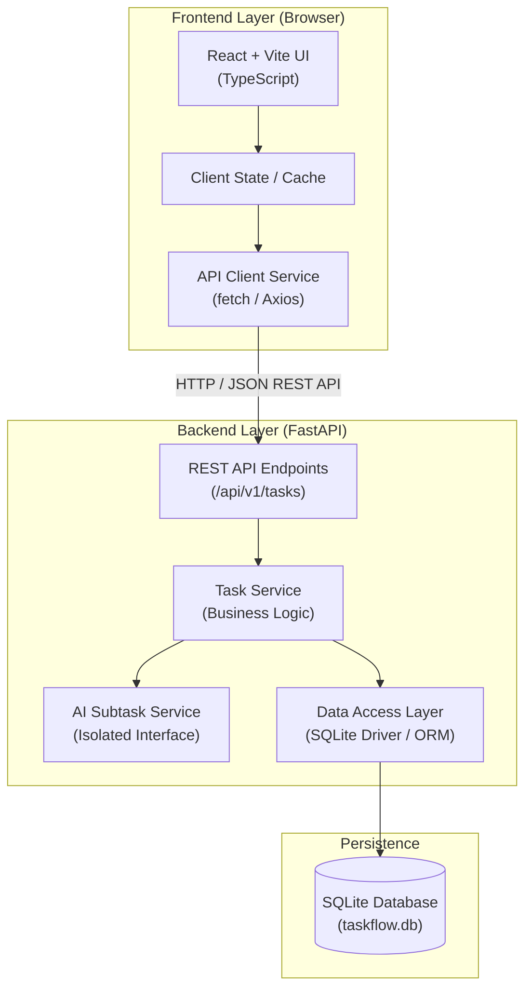

# TaskFlow AI Architecture (`ARCHITECTURE.md`)

This document defines the high-level architecture, subsystem boundaries, data flow, and design principles for TaskFlow AI.

---

## 🏛️ System Overview

TaskFlow AI is structured as a clean, decoupled two-tier client-server architecture with a pluggable backend AI subsystem.

---

## 🧩 Component Responsibilities

### 1. Frontend (`frontend/`)
- **Technology:** React (TypeScript) initialized with Vite.
- **Responsibilities:**
  - Render the Kanban board with interactive column states (`To Do`, `In Progress`, `Done`).
  - Provide modal forms for creating and editing tasks (title, description, priority, status).
  - Handle client-side validation and responsive user feedback.
  - Trigger the "Generate AI Subtasks" action and render suggested subtasks for user confirmation.
- **Design Principle:** Single-Page Application (SPA) communicating strictly with the backend via JSON REST APIs.

### 2. Backend (`backend/`)
- **Technology:** Python with FastAPI.
- **Responsibilities:**
  - Expose versioned REST endpoints for task CRUD operations (`GET`, `POST`, `PUT`, `DELETE`).
  - Expose an endpoint for AI subtask generation (`POST /api/v1/tasks/{id}/breakdown` or similar).
  - Perform input validation and serialization using Pydantic models.
  - Execute business logic and coordinate data persistence.
- **Design Principle:** Stateless, lightweight REST service with automatic OpenAPI / Swagger documentation.

### 3. Database Layer (`backend/`)
- **Technology:** SQLite (file-based relational database).
- **Responsibilities:**
  - Persist task records (ID, title, description, priority, status, subtasks, timestamps).
  - Ensure fast local development setup with zero external database server dependencies.
- **Design Principle:** Embedded SQLite file stored locally and excluded from Git via `.gitignore`.

### 4. AI Subtask Subsystem (`backend/`)
- **Technology:** Isolated Python module / service interface.
- **Responsibilities:**
  - Accept a task description and context.
  - Generate a structured list of actionable subtasks (e.g., breakdown items with brief summaries).
  - Return a clean Python/Pydantic list of subtasks.
- **Design Principle:** Pluggable Architecture.
  - Phase 1 / Local dev: Mock AI generator or rule-based parser.
  - Phase 2: Easy drop-in integration with LLM providers (e.g. Gemini, OpenAI, or local models) without modifying API routes or frontend code.

---

## 🔄 Data Flow & Request Lifecycle

### Typical Task Creation Flow:
1. User fills out task details on the React frontend.
2. Frontend sends `POST /api/v1/tasks` with JSON payload.
3. FastAPI validates the payload against Pydantic schema.
4. Task service writes the record to SQLite and returns the created task with ID and timestamps.
5. Frontend updates local state and renders the card in the `To Do` column.

### AI Task Decomposition Flow:
1. User clicks "AI Breakdown" on an existing or draft task.
2. Frontend sends `POST /api/v1/tasks/{id}/ai-breakdown`.
3. FastAPI delegates the task details to the isolated `AIService` interface.
4. `AIService` produces structured subtasks.
5. Backend returns the suggested subtasks list.
6. Frontend previews the subtasks for user confirmation before saving.

---

## 📋 Architectural Decisions & "To Be Decided" (TBD) Registry

| Area | Initial Status / Decision | Notes & Alternatives (TBD) |
| :--- | :--- | :--- |
| **API Contract Format** | JSON REST over HTTP | OpenAPI v3 standard generated by FastAPI. |
| **Database ORM** | TBD (SQLAlchemy vs SQLModel vs raw sqlite3) | Developer 3 will decide based on simplicity. |
| **Frontend State Manager** | TBD (React Context vs Zustand vs TanStack Query) | Developer 2 will decide during frontend scaffolding. |
| **Drag & Drop Library** | TBD (`@hello-pangea/dnd`, `dnd-kit`, or native HTML5) | Developer 2 will evaluate based on Vite compatibility. |
| **AI LLM Provider** | TBD (Mock adapter initially) | Will implement an abstract interface first; provider selected in AI phase. |
| **Authentication** | Out of Scope for MVP | Can be added in a future milestone if required. |
| **Deployment / Containers** | Out of Scope for Foundation | Standard local execution first; Docker evaluated later. |

---

## 🚫 Non-Goals & Anti-Patterns for Early Phases

- **No Premature Infrastructure:** No Docker, Kubernetes, microservices, or complex cloud orchestration in the foundational phase.
- **No Direct Frontend-to-AI Connections:** All AI interactions must pass through the backend `AIService` boundary.
- **No Direct DB Access from Frontend:** Strict API boundary encapsulation.
